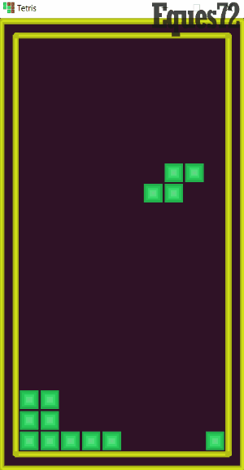

# "Tetris"
Game made with use of Java and build in graphic libraries. It is my first project in Java made from scratch.

## Installation
Clone this repository, compile and run the code. 

## Example

## Controls
- Use A,D to move blocks to left and right
- Press R to rotate block by 90 degrees
- Press S to speed up the block and place it immediately

#### Project created for learning purposes
